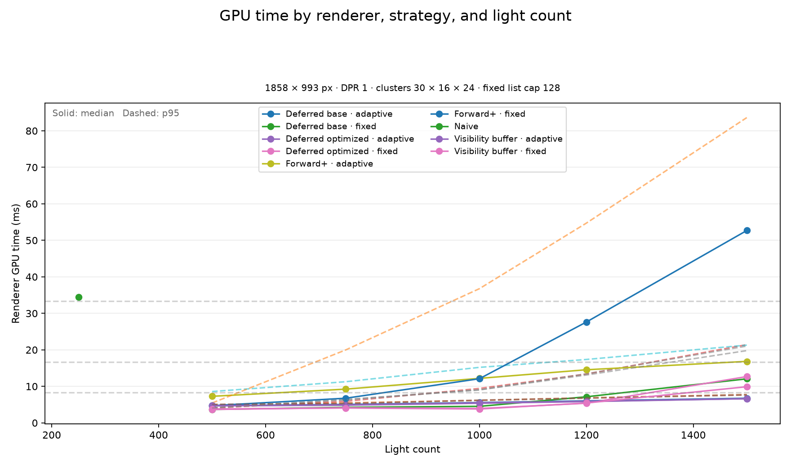
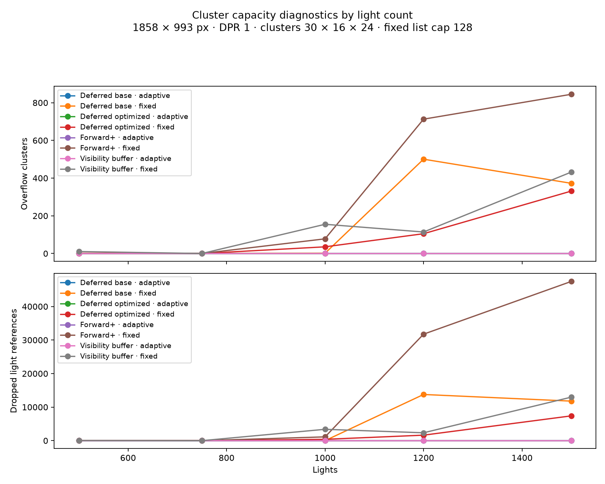
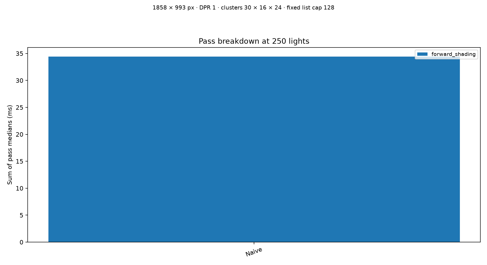
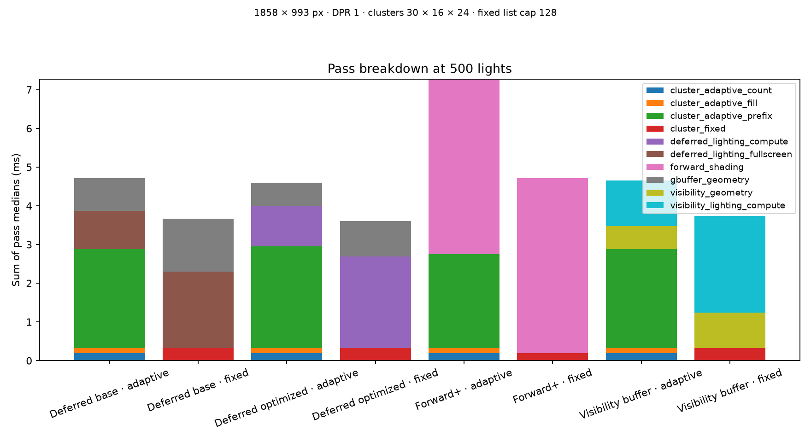
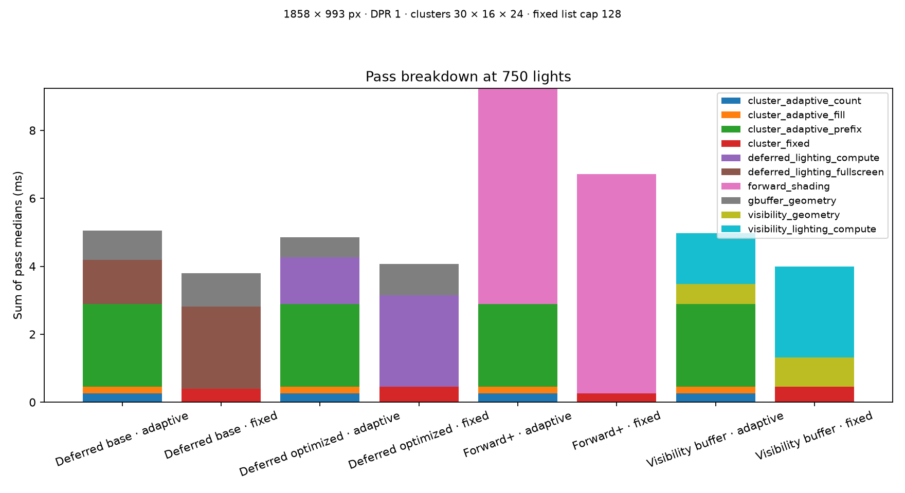
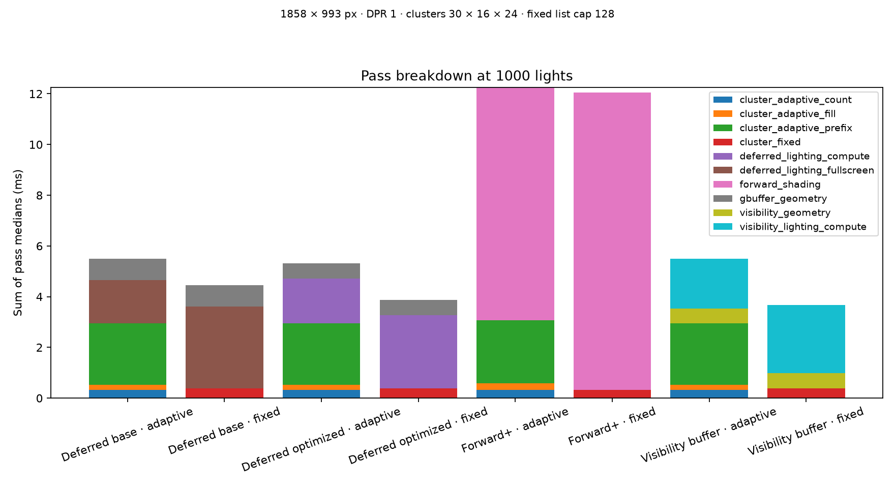
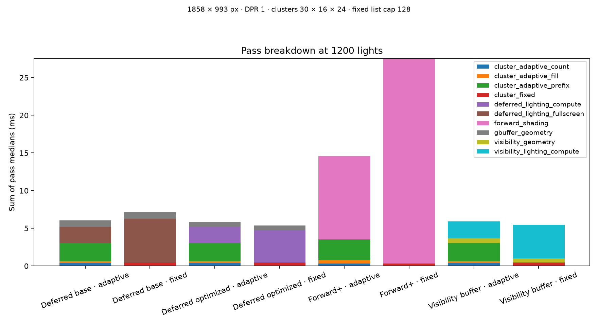
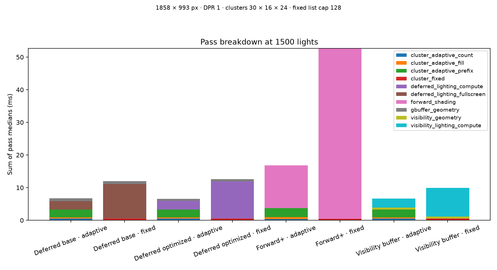

# WebGPU Forward+ and Clustered Deferred Shading


University of Pennsylvania CIS 5650 GPU Programming and Architecture, Project 4.
This project implements and compares several GPU lighting paths over the Sponza
scene: a naive forward baseline, Forward+, clustered deferred shading, an
optimized clustered-deferred path, and a visibility-buffer path.

## Overview

The renderer is written in TypeScript and WGSL and runs in a WebGPU-capable
browser. Animated point lights are generated on the GPU and assigned to screen
tiles and logarithmic depth slices. The advanced renderers reuse the same
cluster data while changing where geometry, material, and lighting work is
performed.

Implemented paths:

- **Naive forward:** every visible fragment evaluates the active light set.
- **Forward+:** geometry is rendered directly while fragments consume their
  cluster light list.
- **Clustered deferred:** writes a G-buffer, then performs clustered lighting.
- **Optimized deferred:** uses packed compute passes and a compact global pool.
- **Visibility buffer:** reconstructs material data during compute lighting.

## Results

The final benchmark used Chrome 153, a 1858 x 993 physical viewport, 30 x 16 x
24 clusters, a fixed capacity of 128 lights per cluster, and light counts of
500, 750, 1000, 1200, and 1500. Each trial recorded GPU timing samples for five
seconds; cluster diagnostics average five post-trial snapshots.

### GPU time by light count



The adaptive Forward+ path is slower at lower light counts because its three
stage compacting pipeline adds overhead. At high light counts, fixed Forward+
begins to overflow its per-cluster capacity and falls back to brute-force
lighting for affected clusters, producing the sharp performance crossover.

### Cluster capacity diagnostics



Adaptive clustering stays within its global pool in this run. Fixed paths begin
to report overflow and dropped references as lights become denser in the same
screen/depth regions. Diagnostics are spatial measurements of animated lights,
so they are not required to be perfectly monotonic.

### Pass breakdowns

| Light count | Pass breakdown |
|---:|:---:|
| 250 |  |
| 500 |  |
| 750 |  |
| 1000 |  |
| 1200 |  |
| 1500 |  |

The 250-light point is the naive baseline and is not a same-light-count
comparison with the clustered renderers.

## Requirements

- Windows with PowerShell
- Node.js and npm
- Python 3.11+ for optional performance analysis
- Chrome or another browser with WebGPU enabled
- A discrete GPU is recommended for comparable timing results

## Run locally

Install JavaScript dependencies:

```powershell
npm install
```

Start the development build. This enables renderer controls and the profiling
queue, which writes captures to `output/<timestamp>/`:

```powershell
npm run dev
```

Create a production build and copy the Sponza assets into `dist/`:

```powershell
npm run build
```

Preview the production build:

```powershell
npx vite preview --host 0.0.0.0
```

WebGPU must be available in the selected browser and adapter. If the canvas is
blank, check browser WebGPU support and select the intended GPU before changing
renderer settings.

## Performance analysis

The renderer does not require Python. To analyze a completed capture batch,
create and activate a normal Python virtual environment:

```powershell
py -3 -m venv .venv
.\.venv\Scripts\Activate.ps1
python -m pip install -r requirements.txt
```

Analyze the session directory containing `batch.json`:

```powershell
python scripts\analyze_performance.py output\2026-09-22_14-39-21
```

The analyzer writes `summary.csv`, `aggregate.csv`, and PNG charts into the
session's `analysis/` directory. It reads every light count in the batch
manifest and creates one pass-breakdown chart per light count.

Run the analysis test:

```powershell
python -m unittest discover -s tests -p test_analyze_performance.py
```

The profiling queue exposes five ordered light-count sliders. Their defaults
are `500, 750, 1000, 1200, 1500`; each slider is constrained by its neighbors
so the values remain strictly increasing. Each non-naive trial collects five
cluster snapshots and stores their aggregate diagnostics.

## Project structure

```text
src/
  main.ts                         Application setup, GUI, benchmark queue
  renderer.ts                     WebGPU device and frame loop
  stage/
    camera.ts                     Camera uniforms and controls
    lights.ts                     Light storage, animation, clustering dispatch
    clusters.ts                   Cluster buffers and diagnostic readback
  renderers/
    naive.ts                      Naive forward baseline
    forward_plus.ts               Forward+ render path
    clustered_deferred.ts         Base clustered deferred path
    clustered_deferred_optimized.ts  Packed deferred path
    visibility_buffer.ts           Visibility-buffer path
  shaders/                        WGSL shaders and shared shader constants
  performance/                    GPU timing, capture, diagnostics, overlay
scripts/
  analyze_performance.py          CSV aggregation and chart generation
  copy-scenes.mjs                 Copies Sponza assets to dist/
tests/
  test_analyze_performance.py     Analysis contract test
scenes/sponza/                    Geometry and textures
images/                           Final benchmark figures
output/                           Raw local benchmark captures
```

## Technical notes

- Shared bind groups are scene `0`, model `1`, and material `2`.
- Host-side buffers and WGSL structs use matching alignment and offsets;
  `vec3f` values occupy 16-byte-aligned storage slots.
- Fixed cluster lists have a bounded per-cluster capacity. An overflow flag
  causes affected Forward+ fragments to use brute-force lighting so they do
  not silently lose light contribution, at a substantial performance cost.
- Adaptive clustering uses count, prefix, and fill passes to allocate a compact
  global light-index pool.
- GPU timings use timestamp queries when supported. CPU timing is not presented
  as GPU timing.

## Validation

The final implementation was checked with:

```powershell
npm run build
python -m unittest discover -s tests -p test_analyze_performance.py
```

Visual and performance results depend on browser version, GPU adapter,
resolution, camera pose, and driver state. Use matched conditions when making
comparisons.

## Credits

- [Vite](https://vitejs.dev/)
- [loaders.gl](https://loaders.gl/)
- [dat.GUI](https://github.com/dataarts/dat.gui)
- [stats.js](https://github.com/mrdoob/stats.js)
- [wgpu-matrix](https://github.com/greggman/wgpu-matrix)
